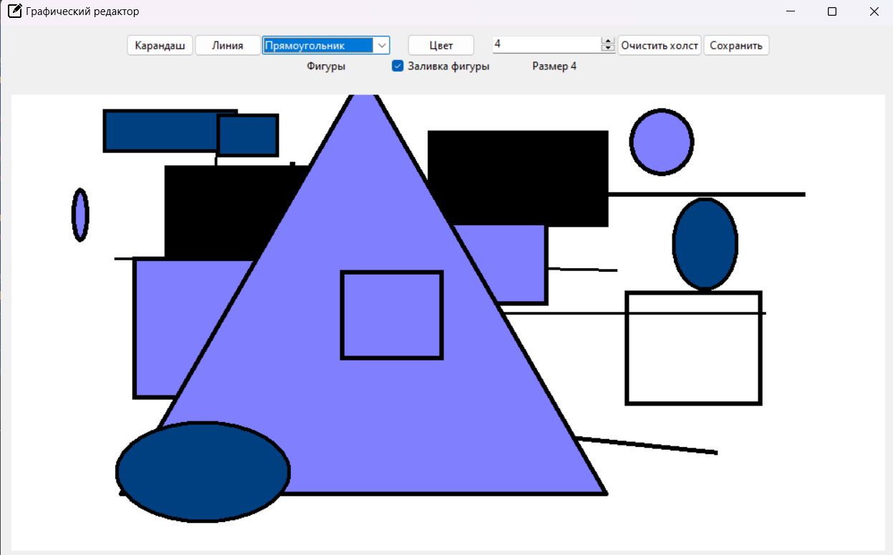
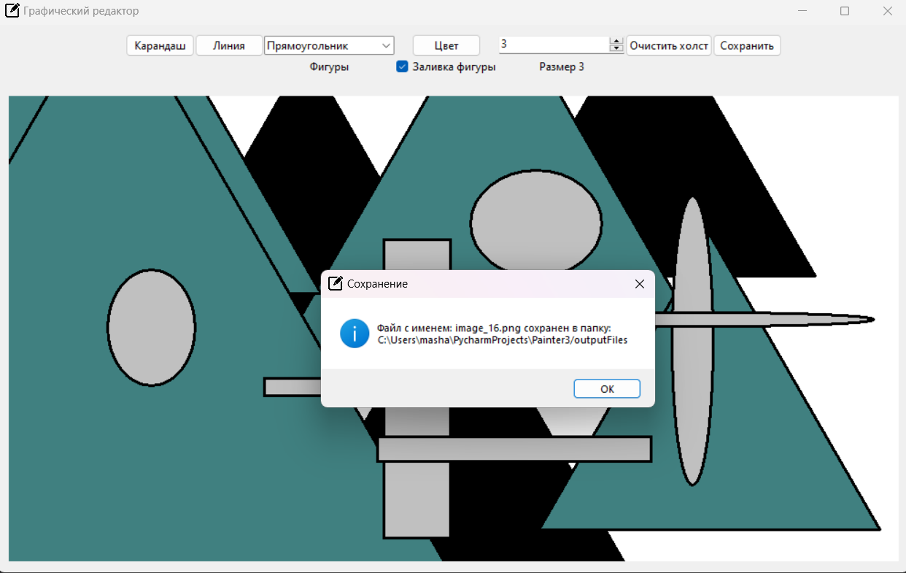
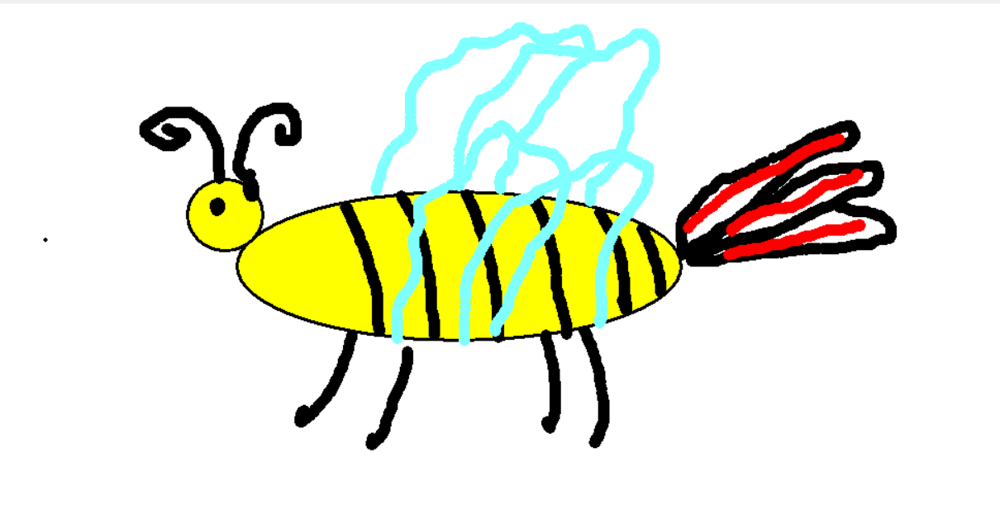

# Графический редактор
Приложение разработано на Python c использованием библиотеки Tkinter
Приложение реализует функционал графичексого редактора и предоставляет следующие возможности:
1. Рисование на холсте.
2. Создание линий и фигур (овалы, прямоугольники, треугольники).
3. Изменение цвета для "каранадша" и заливки фигур.
4. Изменение размера "карандаша" и толщины границ фигур.
5. Возможность очистить холст.
6. Возможность сохранения рисунка в формате `.png`. Картинки сохраняются в папке проекта в папку `outputFiles`.

## Как запустить проект
```cmd
# 1. Для локального запуска необходимо скачать архив проекта или склонировать себе репозиторий
git clone https://github.com/mashabezk/Painter

# 2. Далее необходимо перейти в корневую папку проекта
cd Painter

# 3. Создание виртуальной среды
python -m venv .venv

# 4. Активировать виртуальную среду 
.venv/Scripts/activate

# 5. Установка зависимостей
.venv/Scripts/python -m pip install -r requirements.txt

# 6. Запуск приложения
.venv/Scripts/python main.py
```

### Интерфейс редактора и пример работы в нем:


### Сохранение файла:


### Примеры сохраненных картинок, нарисованных в редакторе:


